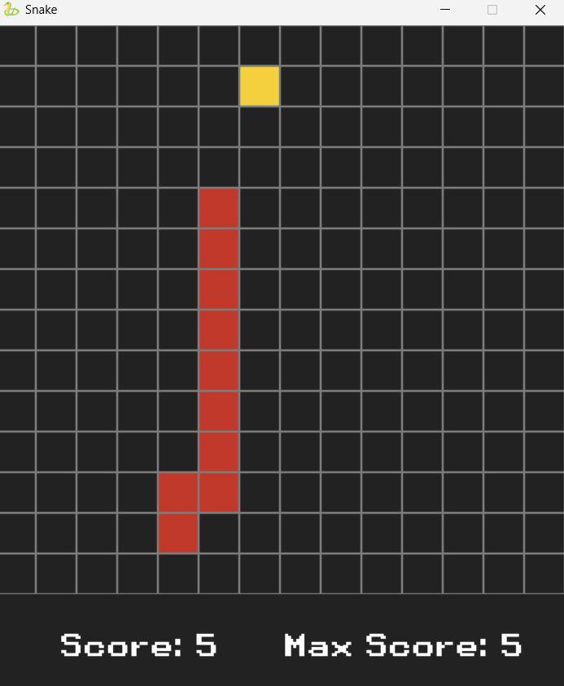

# Snake Game

<!-- add img with custom width-->



## Description

A simple snake game implemented in Python. The objective of the game is to control the snake to eat food and grow in length without colliding with its own body.

## Installation

1. Clone the repository:
   ```bash
   git clone https://github.com/yourusername/snake_game.git
   ```
2. Navigate to the project directory:
   ```bash
   cd snake_game
   ```
3. Install the required dependencies:
   ```bash
   pip install -r requirements.txt
   ```

## Usage

Run the game using the following command:

```bash
python main.py
```

This project is licensed under the MIT License.

## Acknowledgements

- Inspired by the classic Snake game.
